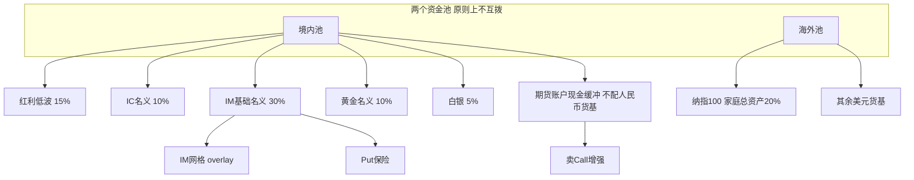
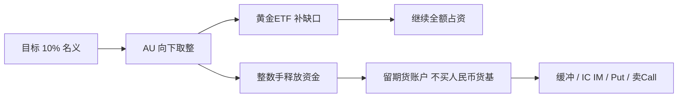
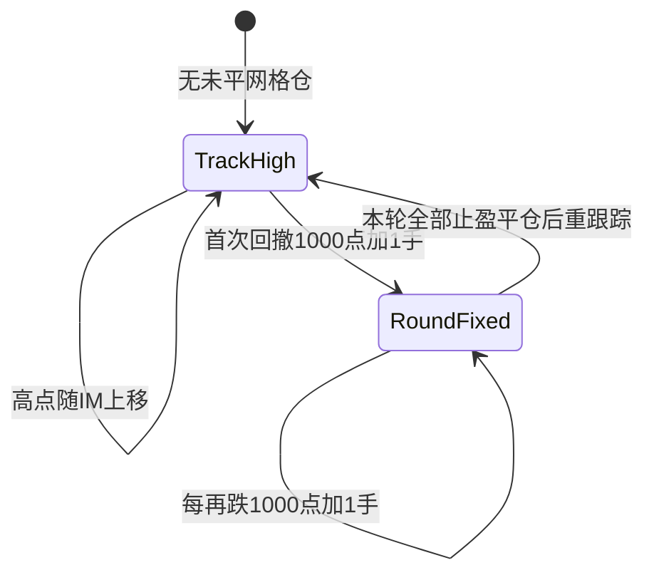
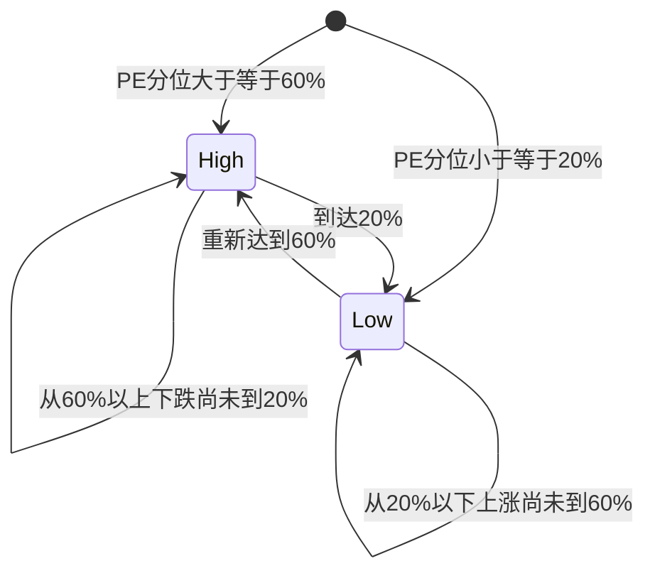
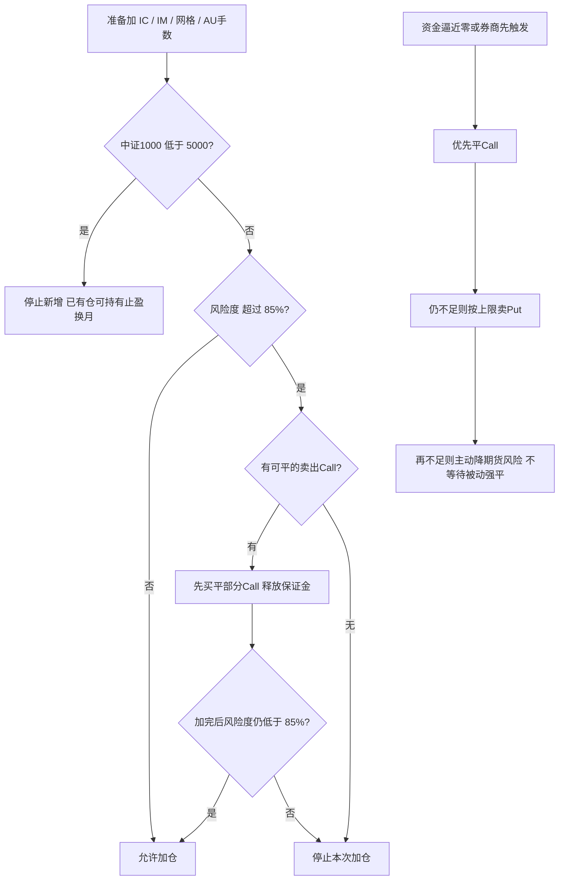
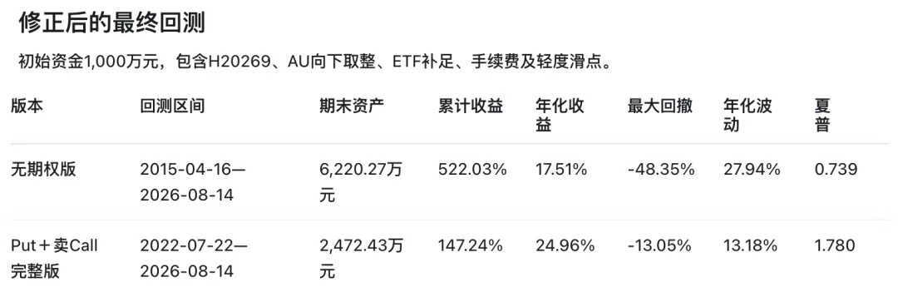
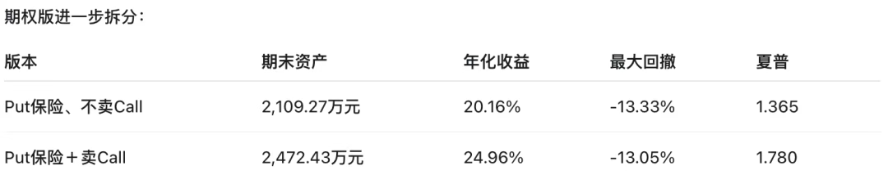

# 完整投资策略

| | |
| --- | --- |
| 来源 | 原创　**蒙蒙0307 / 蒙蒙已Fire** |
| 发布 | 2026年8月27日 12:59　美国 |
| 策略日期 | **2026-08-24** |
| 性质 | 付费公众号规则手册；研究摘录，不是投资建议 |

最近这一轮回测基本已经完成，下面是 Codex 帮我整理的完整投资策略。

---

**目录**

- [一、资产配置](#一资产配置)
- [黄金期货执行规则](#黄金期货执行规则)
- [二、IC与IM基础仓](#二ic与im基础仓)
- [三、IM网格](#三im网格)
- [四、Put保险](#四put保险)
- [五、中证1000卖出Call增强策略](#五中证1000卖出call增强策略)
- [六、风险控制顺序](#六风险控制顺序)
- [七、执行原则](#七执行原则)
- [附录：回测数据](#附录本版投资策略回测数据)



---

## 一、资产配置

投资组合分为境内和海外两个资金池，两者独立管理，原则上不互相调拨。

### 境内目标

| 资产 | 目标权重 | 工具与执行 |
| --- | ---: | --- |
| 中证红利低波动 | 15% | 现货 / ETF；年度再平衡 |
| IC 中证500 名义敞口 | 10% | 股指期货；完整手数 |
| IM 中证1000 基础名义敞口 | 30% | 股指期货；超出部分记网格，不抵扣基础仓 |
| 黄金合计名义敞口 | 10% | AU 优先，手数向下取整；缺口黄金 ETF 补足 |
| 白银 | 5% | — |
| 恒生科技 | 0% | 已清仓 |

黄金优先使用 AU 黄金期货，AU 手数向下取整，不足 10% 的名义敞口由黄金 ETF 补足。AU 覆盖部分释放的现金，与其他境内剩余资金一起留在期货账户，扣除黄金、IC、IM 及期权保证金后，优先作为中证1000 卖出 Call 的资金来源和流动性缓冲，不配置人民币货币基金。

### 海外目标

| 资产 | 目标 | 说明 |
| --- | --- | --- |
| 纳指100 | 家庭总投资资产的 **20%** | 海外池保持既有规模 |
| 美元货币基金 | 纳指配置后的全部余额 | — |
| 美国债券 | **0%** | — |

### 再平衡

| 规则 | 内容 |
| --- | --- |
| 现货 / ETF | 每个自然年首个可交易日，按当日家庭总投资资产恢复目标权重 |
| 年内偏离 | **不再**因权重偏离 1 个百分点触发再平衡 |
| 手数 | IC、IM、AU 按完整合约手数执行 |
| 例外 | 期货换月、IM 网格、Put 保险、卖出 Call 的独立交易及风控规则，不受年度再平衡时点限制 |

---

## 黄金期货执行规则

黄金目标名义敞口为家庭总投资资产的 **10%**，优先使用上海期货交易所 AU 黄金期货替代黄金 ETF。每手合约名义价值按「AU 合约价格（元/克）×1000 克/手」计算。

每次组合再平衡时，先按下式计算理论手数：

```text
AU理论手数     = 家庭总投资资产 × 10%  ÷  (AU合约价格 × 1000)
AU实际手数     = 向下取整(AU理论手数)
黄金ETF补足金额 = 家庭总投资资产 × 10%  −  AU实际手数 × AU合约价格 × 1000
```

AU 实际持仓按理论手数一律向下取整数手。黄金目标金额减去 AU 整数手名义价值后的不足部分，持有黄金 ETF 补足，使 AU 与黄金 ETF 的合计目标名义敞口达到 10%。只在年度再平衡日重新计算 AU 手数和黄金 ETF 补足金额；年内不因理论手数或黄金权重的变化频繁调仓。



| 换仓 | 规则 |
| --- | --- |
| 合约 | 季月；原则上 3 / 6 / 9 / 12 月换至下一可交易且流动性合格的季月 |
| 手数 | 只维持已有手数，不主动改变黄金仓位 |
| 与再平衡同日 | 先按总资产和新合约价格向下取整重算 AU 手数，再调 ETF 补足并完成换仓 |
| 提前 | 临近交割、流动性明显转移、或期货公司要求时可以提前 |

黄金期货保证金按期货公司实时标准计入期货账户风险度。只有 AU 整数手所覆盖的黄金名义金额释放资金；黄金 ETF 补足部分继续占用全额资金。AU 覆盖金额扣除实际保证金后的净释放现金不购买人民币货币基金，统一留在期货账户；在满足流动性缓冲、IC/IM 加仓、换月和 Put 保险需求后，可按第五部分规则用于卖出中证1000 Call。黄金期货浮动亏损、保证金上调和换仓支出会直接减少可用于卖 Call 的容量。

---

## 二、IC与IM基础仓

| 标的 | 长期目标名义敞口 | 合约 | 换月 |
| --- | ---: | --- | --- |
| IC 中证500 | 组合资产的 **10%** | 逐月 | 到期前 **3 个自然日** 换至下月 |
| IM 中证1000 基础仓 | 组合资产的 **30%** | 逐月 | 同上 |

当前持有的 IM 先计入 30% 基础仓，超过基础目标手数的部分才归入网格仓，网格仓不抵扣基础仓。换月属于维持已有敞口，不属于新增仓位。

> **硬闸：中证1000 &lt; 5000 点**  
> 停止一切新增 IC、IM 基础仓和 IM 网格仓；已有仓位继续持有，可以正常减仓、止盈及换月。重新回到 5000 点或以上后，才恢复按目标仓位和网格规则检查新增。

---

## 三、IM网格



网格顶部采用「本轮下跌前高点」，不再按自然年度清零。没有未平网格仓时，高点随 IM 行情上移；首次网格触发后固定本轮顶部，不因日历跨年或中途反弹而改变；当本轮所有网格仓均完成反弹止盈后，从当时点位重新开始跟踪下一轮下跌前高点。

从本轮下跌前高点首次回撤 1000 点时新增 1 手 IM 网格仓；此后每再下跌 1000 点新增 1 手。每手网格仓独立建立台账，记录成交日期、合约、实际加仓价格、历次换仓价格和累计换仓收益。

每手网格仓的止盈点为该手的等效成本加 1000 点。换仓后：

```text
新等效成本   = 原等效成本 + 新合约开仓价 − 旧合约平仓价
累计换仓收益 = Σ(旧合约平仓价 − 新合约开仓价)
```

换仓产生的收益会直接降低该手的后续止盈点，换仓产生的成本会相应抬高止盈点。当前合约达到或超过该手止盈点时，资产管理软件必须提示平仓；每手分别判断，不合并使用平均价。

### 截至 2026-08-18 的实盘账本

| 项目 | 数值 |
| --- | --- |
| 持仓 | 1 手网格仓 |
| 开仓 | 2026-07-31　IM2609　**7091.4** 点 |
| 换仓 | 2026-08-10　整批 4 手 IM，按该批成交加权均价分摊 |
| IM2609 平仓均价 | 7570.4 点 |
| IM2612 开仓均价 | 7380.05 点 |
| 换仓收益 | **190.35** 点 |
| 等效成本 | **6901.05** 点 |
| 理论止盈线 | **7901.05** 点 |
| 可执行提醒（最小变动 0.2） | **7901.2** 点 |

如果某一触发档位出现时中证1000 已经低于 5000 点，则该档位不新增仓位，不在更低位置追补。

---

## 四、Put保险

保险标的是中证1000 股指认沽期权。

| 步骤 | 规则 |
| --- | --- |
| 期限 | 正常选剩余 **30—59** 个自然日 |
| 月份 | 合格期限中选最近到期月 |
| 行权价 | 该月全部可交易、可估值 Put 按行权价从低到高，选**最低行权价（最虚档）** |
| 窗口空缺 | 选距离 30 天或 59 天边界最近的到期月；距离相同优先较近月 |
| 换仓 | 期限、到期月份或最虚档条件变化时换仓 |

保护数量以中证1000 从当前点位跌至 Put 行权价时，能够覆盖全部 IM 基础仓和网格仓损失为目标。保护价值按所选最虚档 Put 上涨为同期限平值 Put 时的价格增值计算，包含期权时间价值与隐含波动率影响。

| 阶段 | 规则 |
| --- | --- |
| 市值上限 | **16 万元 × IM 总手数** |
| 持有期 | 「只增不减」：需求上升且未触顶则补仓；需求下降不减持；仅卖出超过上限的部分 |
| 换新约 | 按换仓当日理论保护需求和市值上限重新确定初始建仓数量 |
| 手续费 | 每张每边 **18 元** |
| 回测滑点 | 买入 = 基准 + max(基准×5%, 0.2 点)；卖出对称，下限 0；持仓估值用基准价 |

> **应急阶段**  
> 期货账户可用资金逼近零、存在被动减仓或强平风险时，可以突破常规保护手数，继续卖出剩余 Put，现金优先维持 IC、IM 保证金；必要时 Put 可以全部平仓。  
> 压力测试必须分别报告：**首次应急卖 Put 警戒点**，以及 **Put 全部处置后的最终资金归零点**。

---

## 五、中证1000卖出Call增强策略

在不改变原有资产配置、AU 黄金期货、IC/IM 基础仓、IM 网格及 Put 保险规则的前提下，将境内剩余可用资金统一留在期货账户，作为期货及卖出 Call 的保证金缓冲。卖出 Call 使用中证1000 股指认购期权，合约乘数及保证金按中金所和期货公司实时口径执行。

### 1. 新开仓的共同条件

| 条件 | 要求 |
| --- | --- |
| IV | 中证1000 约 30 日平值 IV **&gt; 24%** 才允许主动新增 |
| 风险度 | 新开仓完成后 **≤ 85%** |
| 数量 | 扣除 AU、IC、IM、Put 及已有卖出 Call 保证金后的剩余容量 |
| 放弃 | 保证金不够 / 无合格期限与虚值合约 / 新增后风险度将超 85% |

「IV 高于 24%」限制适用于主动新增仓位，以及快速下跌后的向下换仓；**不适用于**已有空头受到上涨威胁时的规则 7 防御性向上向后移仓。

### 2. PE状态与合约选择



| 状态 | 触发 | 选约顺序（都不满足则放弃） |
| --- | --- | --- |
| 高位 | 十年 PE 分位 **≥ 60%** | 30—60 天且虚值 ≥15% → 60—90 天且虚值 ≥20% → 90—120 天且虚值 ≥25% |
| 低估 | 十年 PE 分位 **≤ 20%** | 只卖 30—60 天且虚值 **≥ 25%** |

PE 状态采用路径延续规则：从 60% 以上开始下跌、尚未到达 20% 以前，继续沿用高位状态规则；从 20% 以下开始上涨、尚未重新达到 60% 以前，继续沿用低估状态规则。

### 3. 盈利95%单次止盈与远月续卖

每个卖出 Call 持仓批次独立计算收益。期权价格相对该批次实际开仓均价下跌 **95%** 时，只触发一次止盈，先买回该批次原始数量的 **50%**；不再使用盈利 40%、60% 和 80% 分别买回原始数量 20% 的旧分批止盈规则。止盈数量按原始开仓数量计算，不因此前风险减仓或移仓而缩小计算基数；实际买回数量不得超过当时剩余持仓。

完成首次 50% 止盈后，按现有新卖出规则重新检查 IV、PE 状态、合约期限、虚值程度和 85% 新增风险度上限。如果存在严格晚于原到期月份且符合卖出规则的远月 Call，则买回剩余近月仓位并将该剩余数量挪至远月；如果没有合格远月，不为了续收权利金降低行权价或放宽风险条件，剩余近月仓位继续按 5% 防御移仓、95% 风险强减等规则管理，否则允许等待无价值到期。

### 4. 快速上涨时的强制防御性移仓

持有卖出 Call 期间，只要该 Call 的虚值程度收窄至 **5% 以内**，即认定已有空头受到上涨威胁，必须优先执行向上向后移仓：买平原 Call，新 Call 行权价至少比原行权价提高 5%，并优先选择比原到期月份向后一个月的可交易合约。每条持仓链独立记录累计向上移仓次数。

| 约束 | 内容 |
| --- | --- |
| IV | 防御性移仓**不受** IV&gt;24% 限制（管已有风险，不是新卖风险） |
| 次数 | 同一持仓链最多连续向上向后移仓 **5 次** |
| 第 6 次 | 再触发虚值收窄至 5% 以内 → 买平该链并**止损** |
| 无合格新约 | 先买平受威胁的原 Call；不得为维持权利金降低行权价或缩短期限 |

### 5. 快速下跌时的向下换仓

持有卖出 Call 期间，如果剩余期限在 60 天以内，且虚值程度从低于 25% 扩大并首次达到 25% 及以上，可以换至剩余 30—60 天、虚值约 15% 的 Call，以重新获取时间价值。该规则优先于盈利 95% 的单次止盈规则。

向下换仓包含新的卖出动作，因此仍须满足 IV 高于 24%，且换仓完成后的期货账户风险度不得超过 85%。若条件不满足，则不执行向下换仓，继续按原持仓止盈或到期规则管理。

### 6. 风险度与存量仓位减仓

| 阈值 | 含义 | 动作 |
| ---: | --- | --- |
| **≤ 85%** | 新增卖出 Call 准入上限 | 可以主动新开 |
| **85%—95%** | 禁新增、存量可留 | 禁止主动加卖 Call；已有仓可持有、止盈、到期或防御性移仓 |
| **&gt; 95%** | 存量强制减仓线 | 必须继续买平卖出 Call，直到回到 95% 以内 |

主动新增卖出 Call 时，风险度上限仍为 85%。新仓建立后，不因风险度随后超过 85% 而立即被动减仓。每天先执行快速下跌换仓、虚值 5% 防御性向上向后移仓、盈利 95% 止盈及远月续卖等持仓管理动作，完成后重新计算期货账户风险度；只要风险度仍超过 95%，无论当天是否发生移仓，都必须继续买平卖出 Call，直至风险度重新回到 95% 以内。

因此，85% 是新增卖出 Call 的准入上限，95% 是存量卖出 Call 的强制减仓线，两者不得混用。券商盘中追加保证金、提高保证金率或强平要求高于本策略阈值时，以券商实际风控要求为准，必要时提前减仓。

---

## 六、风险控制顺序



- 中证1000 低于 5000 点：停止新增 IC、IM 基础仓和 IM 网格仓。
- 准备新增 IC、IM 基础仓、IM 网格仓或因组合再平衡增加 AU 手数时，如当前期货账户风险度超过 85%，先检查是否持有可平仓的卖出 Call。若有，先买入平仓部分卖出 Call 以释放保证金，并重新测算；只有预计完成本次期货加仓后风险度仍低于 85%，才允许加仓。若没有可平仓的卖出 Call，或平仓后预计风险度仍不能低于 85%，则停止本次加仓。AU 季度等手数换仓属于维持已有敞口，不属于新增仓位。
- 上述 85% 规则同时适用于 AU 增仓、IC 基础仓、IM 基础仓和 IM 网格仓；换月、减仓及已有网格仓止盈不属于新增，不受该规则限制。
- 可用资金逼近零，或者券商实际风控要求已经先于模型触发：优先平仓 Call 释放保证金；正常情况下存量 Call 只在风险度超过 95% 时强制减仓。如仍不足，按常规上限规则卖 Put，必要时继续应急卖出剩余 Put。
- Call 及 Put 可变现资金仍无法维持保证金时，优先主动降低期货风险，不等待被动强平。

5000 点止加规则与 85% 的加仓风险度规则同时存在。已有期货合约可正常换月，已有网格仓达到反弹目标后正常止盈。

---

## 七、执行原则

| 原则 | 内容 |
| --- | --- |
| 目标优先 | 策略目标优先于短期观点，不因单日涨跌临时改变目标仓位 |
| 四约束同时满足 | 指数点位规则、账户风险度、可用资金、Put 保护能力 |
| 保证金合并 | AU、IC、IM 和期权必须合并计算；黄金期货释放的现金不得重复视为无条件可用资金 |
| 券商优先 | 实时保证金与强平要求高于模型估算时，以**华联期货**实际风控口径为准 |

---

## 附录：本版投资策略回测数据

### 修正后的最终回测

初始资金 **1000 万元**，包含 H20269、AU 向下取整、ETF 补足、手续费及轻度滑点。



| 版本 | 回测区间 | 期末资产 | 累计收益 | 年化收益 | 最大回撤 | 年化波动 | 夏普 |
| --- | --- | ---: | ---: | ---: | ---: | ---: | ---: |
| 无期权版 | 2015-04-16 — 2026-08-14 | 6,220.27 万元 | 522.03% | 17.51% | -48.35% | 27.94% | 0.739 |
| Put + 卖Call 完整版 | 2022-07-22 — 2026-08-14 | 2,472.43 万元 | 147.24% | 24.96% | -13.05% | 13.18% | 1.780 |

> 两行样本期不同：无期权从 2015 年起，期权版从 2022-07-22 起。年化与回撤不可直接横向对比。

期权版进一步拆分：



| 版本 | 期末资产 | 年化收益 | 最大回撤 | 夏普 |
| --- | ---: | ---: | ---: | ---: |
| Put保险、不卖Call | 2,109.27 万元 | 20.16% | -13.33% | 1.365 |
| Put保险 + 卖Call | 2,472.43 万元 | 24.96% | -13.05% | 1.780 |

---

上一篇 · 50万滚IC安全吗？

### 留言 2

**安如写写字**　广东　19分钟前　`首评`

恒科0%，清仓了？

**蒙蒙已Fire**　作者　11分钟前

是的 回测来看持有性价比不高
